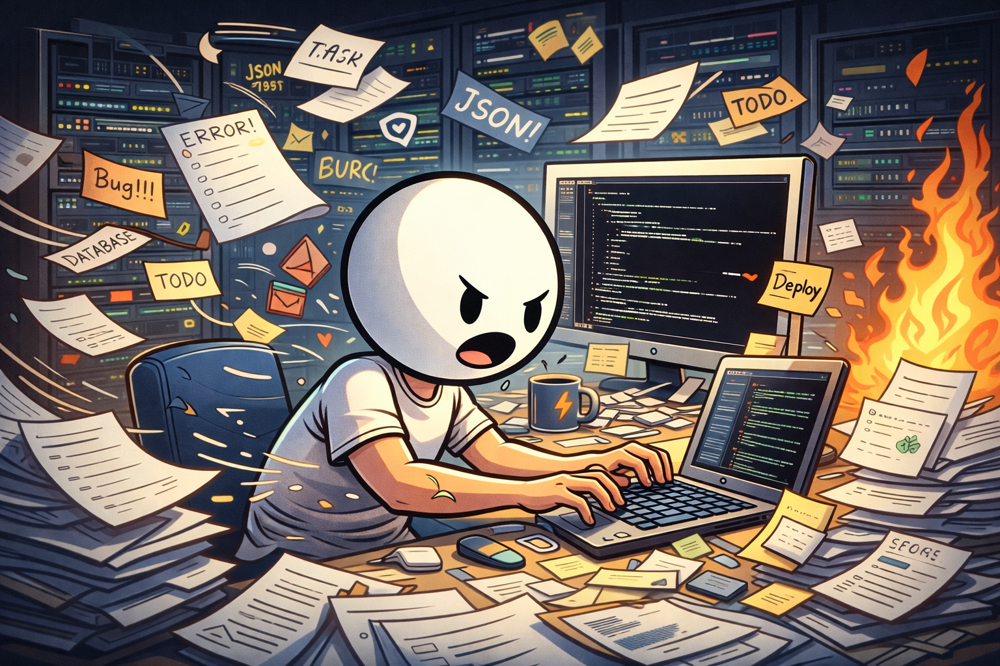
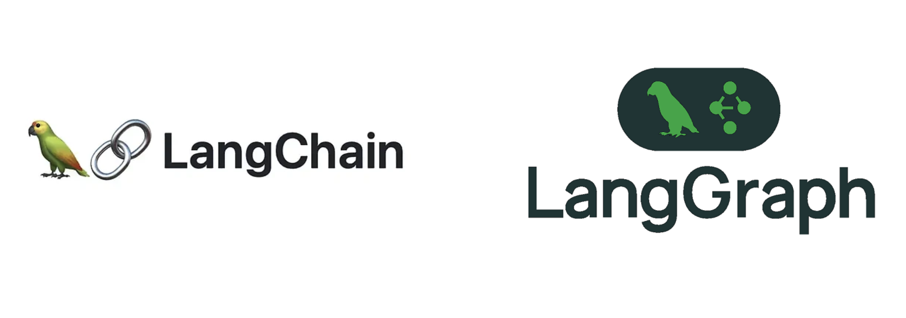
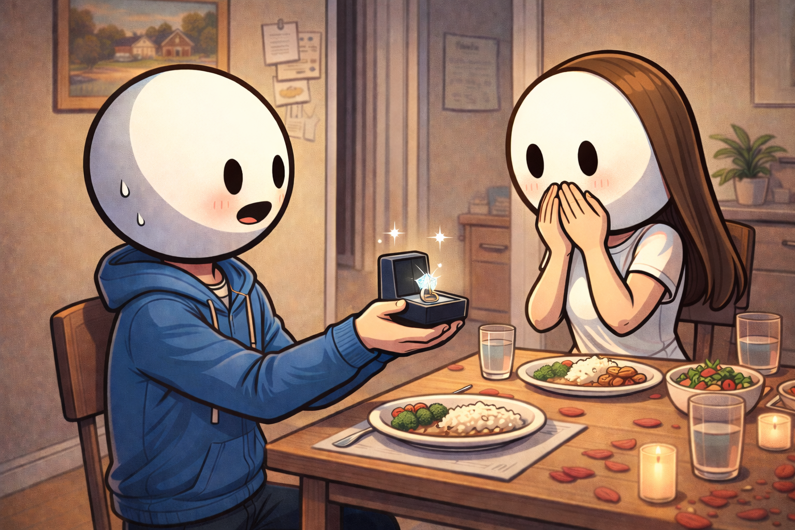
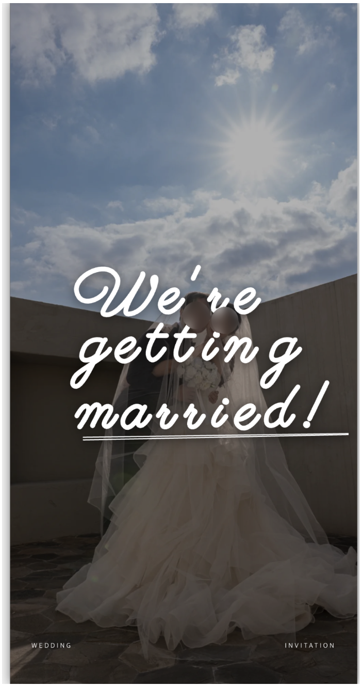
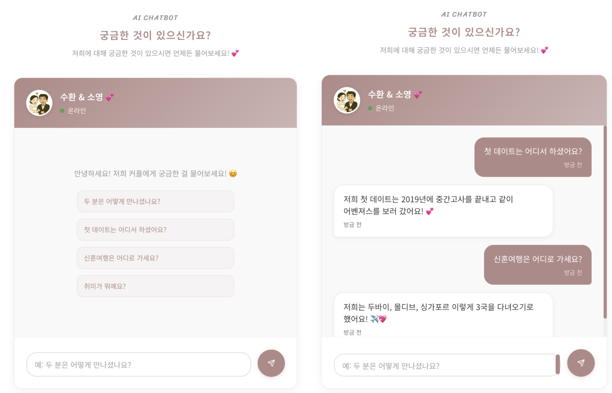
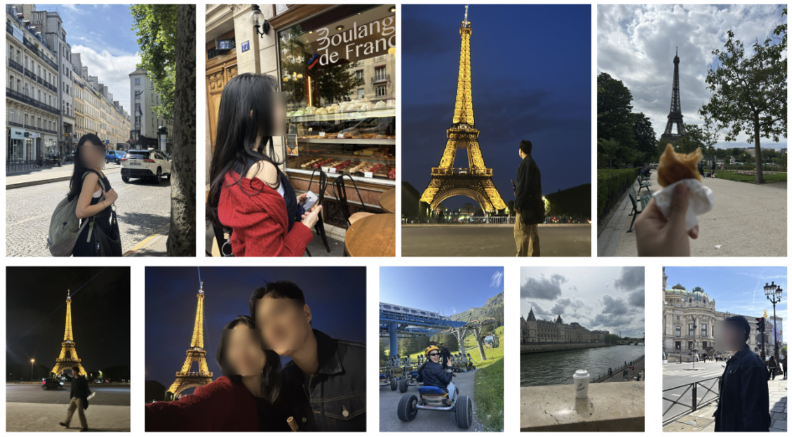
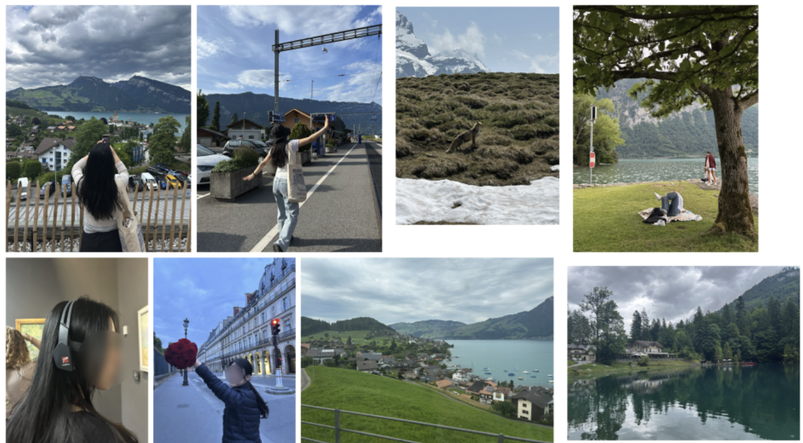
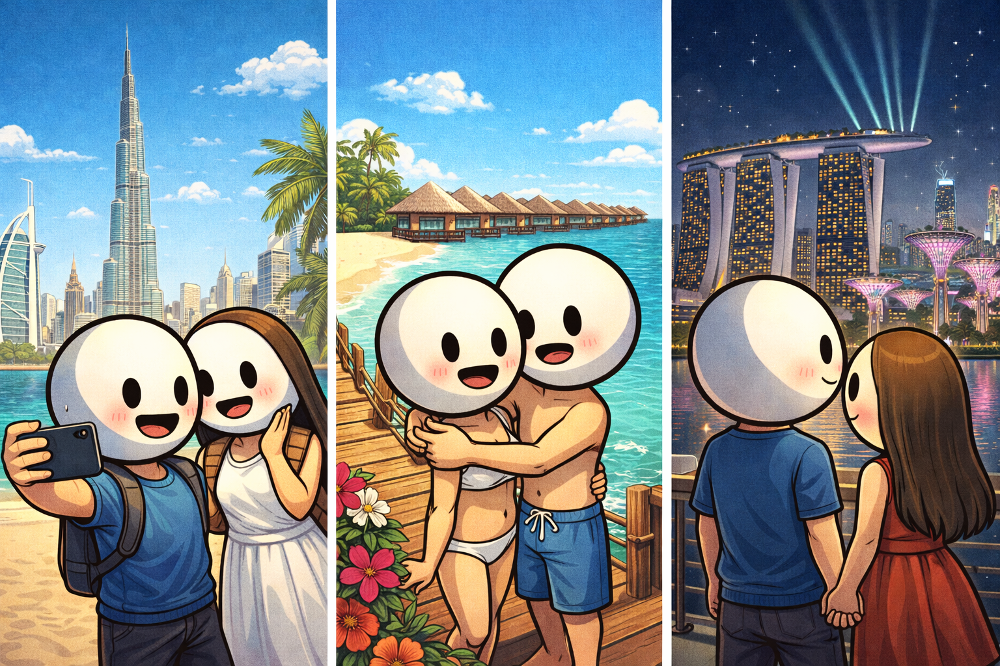
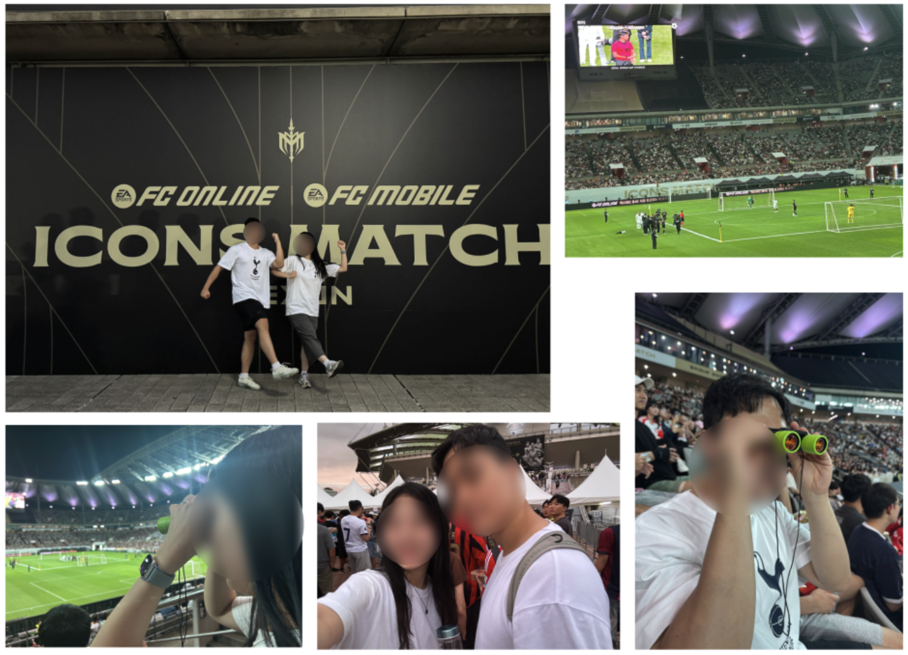
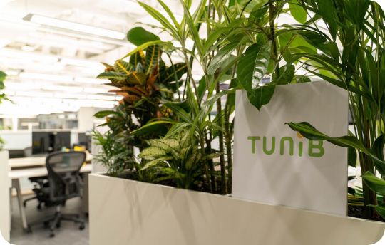

# Throwback 2025

- [2020년 회고 글](https://sooftware.io/2020/)
- [2021년 회고 글](https://sooftware.io/2021/)
- [2023년 회고 글](https://sooftware.io/2023/)
- [2024년 회고 글](https://sooftware.io/2024/)

2025년 회고 글입니다! 2024년 회고 글을 읽고서 이 글을 작성중인데, 작년 회고 때 다짐했던 운전 연수나 스터디 카페 다니는 걸 실천 못했더군요.. 😅   
  
곧 해야지.. 곧 해야지.. 하다보니 어느새 2025년이 끝나버렸습니다 😭   
  
하지만 2025년은 제게 잊지못할만큼 여러 추억을 남긴 해였기 때문에, 회고에 기억나는 순간들을 하나씩 기록해두려고 합니다.  

## 회사 생활

올해 회사에서 주로 맡았던 작업은 DearMate 서비스 신규 기능 개발 및 전체 구조 리팩토링이였습니다. 작년에는 기존 개발자분들이 작업하던걸 이어받아서 어찌어찌 응급처치를 해두던가 겨우겨우 돌아가게 만들어두는 정도였다면, 올해는 전반적인 구조를 모두 파악하고 어느 부분을 개선해야할지, 신규기능을 구현하려면 어디를 수정해야하는지를 정확하게 파악된 채로 작업하게 됐습니다.   

그 결과로 올해 DearMate는 글로벌 서비스를 위한 언어 확장(영어, 일본어, 중국어, 아랍어, 스페인어), 오픈채팅방, 전체적인 앱 속도 개선 등 여러 부분의 신규 기능 개발과 사용자 경험을 향상시키기 위한 작업들을 했습니다. 여전히 많은 버그들과 싸웠지만, 그래도 지금은 안정적으로 신규 기능들과 함께 서비스되고 있는 모습을 보며 흐뭇하고 대견스러운 마음도 듭니다!
  
## LangChain & LangGraph 강의
   

저희 회사 대표님의 소개로 "LLM 기초, 그리고 LangChain & LangGraph"에 대한 강의를 진행했습니다. MetaCode라는 플랫폼에서 오프라인 1회, 녹화 1회 강의를 했습니다. 15분 ~ 1시간 정도의 발표 경험은 꽤 있었지만, 하루 종일 진행하는 강의를 해본 적은 없었어서 부담스럽기도했고, LangChain 사용은 많이 해봤지만 강의자료를 만들 정도로 능숙한가? 에 대해서 저 스스로에게 의문이 들기도 해서 강의를 받으면 안 될 것 같다는 생각이 들었습니다. 고민을 하다가 '이참에 LangChain & LangGraph 기초부터 다시 공부를 하면서 강의자료를 만들어보자!' 라는 생각으로 강의를 수락하고 몇 개월간 틈틈히 강의자료를 만들어서 성공적으로 강의를 마칠 수 있었습니다. PDF로 총 266 페이지에 달하는 강의자료를 만들었고, 강의를 준비하면서 저도 다시 한 번 복습하고 이론적으로 다시 적립할 수 있는 계기가 돼서 좋은 경험이였습니다!

## I’m getting married!

올해 2월에 여자친구에게 프로포즈를 했습니다! 2024년 말에 여자친구에게 프로포즈해야겠다는 생각을 하고, 나름의 준비를 해서 올해 2월에 프로포즈를 했고, 여자친구가 받아줬습니다. 😆  
  
그래서 저는 2026년 5월에 결혼하게 됐습니다! 🥳 🎉
  
올해를 돌아보면 기억의 대부분이 결혼 준비였던 것 같습니다. 🫠    
  
먼저 결혼한 선배들에게 들었을때 결혼 준비가 힘들다는 얘기를 많이 들었었는데, 저는 다행히 힘들다기 보단 재밌게 준비한 것 같습니다. 여자친구가 저보다 많이 알아봐준 덕분이라고 생각합니다. 😀   
   
결혼식장 위치, 상견례, 신혼집, 웨딩 사진, 신혼여행, 결혼반지 등등.. 정할게 많긴 많더라구요 😅  
  
주말에는 거의 저랑 여자친구 모두 결혼 준비하는데 썼습니다. 그래도 어느덧 결혼준비도 점점 거의 끝나가는 것 같습니다..!!

  
그리고 제가 개발자인 만큼 모바일 청첩장은 직접 만들었습니다! 저랑 여자친구가 원하는 모든 기능을 넣기 위해서 여자친구의 기획 + 저(+ Claude)의 개발로 현재 마무리 단계에 있습니다.   

평범한 모바일 청첩장보다는 한 단계 더 나은걸 만들고 싶어서 제 직무를 살려서 LangGraph 기반의 RAG 챗봇을 만들어서 탑재했습니다. 이번에 구현한 모바일 청첩장은 완성되고나면 추후에 오픈소스로 공개할 예정입니다. 오랜만의 오픈소스 프로젝트 공개가 되겠네요. 😁
  
## Journey (France, Swiss)

  
유럽 여행을 가보는게 어렸을때부터 로망이였습니다! 그런데 대학교를 졸업하고보니, 생각보다 길게 시간 내는게 쉽지가 않아서 어느새 나이는 30이 넘었는데 유럽 여행을 못가봤더라고요. 괜히 대학생때 유럽 배낭 여행 다녀오라는게 아니구나.. 하며 생각하다가 앞으로는 더 시간 내기가 어려울거라는 생각에 '더 미루지말고 유럽 여행 다녀오자!' 라는 생각으로 올해 초에 유럽 여행을 계획했습니다.  

이탈리아, 영국, 스위스, 프랑스, 독일 등.. 가고 싶은 나라는 많았지만 10일 정도의 일정으로는 2개국만 다녀오는걸 추천하길래 도시도시한 프랑스와 자연자연한 스위스를 다녀오게 됐습니다. 여자친구와 여행을 세부, 사이판 같은 휴양지로 다녔어서 이번 유럽여행은 더 재밌었습니다!

파리의 에펠탑과 센강, 루브르 박물관, 스위스의 자연풍경 등 너무 좋은 추억들을 남겼습니다. 프랑스에서는 주로 걸어다니거나 버스를 타고 돌아다녔는데, 건물 하나하나가 웅장하고 멋있어서 도시를 걸어다니기만해도 즐거웠습니다. 루브르 박물관과 오랑주리, 오르셰 미술관에서도 어렸을 적 교과서에서나 보던 미술 작품들을 감상할 수 있었고, 스위스에서는 윈도우 배경화면 같은 자연 풍경들이 너무 이뻤습니다. 스위스에서는 야생의 여우도 봤습니다! 스위스에서도 야생 여우는 보기 힘들다던데 운이 정말 좋았습니다. 😁
  

  
그리고 저희가 파리에 도착한 날이 2024-2025 챔피언스리그 결승전이 있던 날인데, 파리 생제르맹(PSG) 팀이 챔피언스리그를 처음으로 우승을 해서 파리 현지의 축제 분위기를 직접 느꼈습니다. 점점 과격해지는 분위기에 얼른 숙소로 돌아갔는데, 그 날 사망자가 2명이나 나왔었다고 합니다. 😢 프랑스라는 나라의 좋은 점도 여럿 느꼈지만, 아직은 아쉬운 부분에 대해서도 느낄 수 있었습니다.   

  
그리고 저희가 신혼여행은 두바이 ➜ 몰디브 ➜ 싱가폴로 가기로 했습니다! 신혼여행인만큼 신혼여행이 아니면 가기 힘든곳을 가보기로 했고, 여러 쟁쟁한 후보들중에서 최종적으로 몰디브를 다녀오기로 했습니다. 몰디브를 가는 김에 경유지인 두바이와 싱가폴을 모두 들려보기로 했습니다. 세 나라 모두 처음 가보는거라 신혼여행이 상당히 기대됩니다! 😆
  
## ICONS MATCH

  
넥슨 주최의 ICONS MATCH에 다녀왔습니다! 아이콘 매치를 한다는건 알았지만, 표 구할수가 없을 것 같아 그림의 떡이라고 생각했는데 여자친구 회사에서 추첨으로 티켓을 나눠줬습니다. 운좋게도 여자친구가 당첨이 돼서 아이콘 매치에 다녀올 수 있었습니다! 🥳. 

정말 화려한 라인업의 세계적인 선수들을 가까이서 볼 수 있어서 좋았습니다! 박지성, 디디에 드록바, 가레스 베일, 스티븐 제라드, 아자르, 루니, 카카 등.. 학창시절에 봐오고 피파온라인에서나 써봤던 선수들을 실제로 볼 수 있어서 너무 설렜습니다. 좋은 경험 만들어준 여자친구에게 감사함을 보냅니다!
  
## 5KG 감량
  
작년과 비교해서 5KG 정도를 감량했습니다! 결혼 준비를 시작하고 감량을 시작했는데, 1차 목표였던 5KG 감량에 성공했습니다. 기존에 1RM ~ 3RM 정도의 중량을 들던 방식에서 8 ~ 12회를 반복 가능한 중량 운동을 메인세트로 바꿨고, 운동 후에 천국의 계단을 10~25분 정도를 꾸준히 해줬습니다. 점심에는 햄버거나 파스타, 포케 같이 초록초록한 야채들이 섞인 메뉴들로 먹고 저녁에는 먹고 싶은 메뉴 그냥 먹는 식으로 했는데, 결과는 성공적이였습니다!     
  
덕분에 웨딩사진에는 올해 초보다는 조금 더 갸름한 모습으로 사진을 남길 수 있었습니다. 이제 결혼식까지 4개월+ 정도 남았으니 그떄까지 3KG 정도 추가 감량하는게 목표입니다. 🏋  

## 튜닙 퇴사 (예정), 이직 준비
  

  
어느덧 튜닙 창업하고 5년 가까이 지났습니다. 2026년 3월이면 5년을 채우게 됩니다. 벌써 5년이라는 생각이 드는 한 편, 돌이켜보면 많은 일들이 생각나서 이제야 5년이 된 건가 싶은 마음이 공존합니다. 튜닙에 있으면서 여러 경험, 여러 동료들과 함께 좋은 경험들을 했습니다. 그동안의 경험이 앞으로 저의 삶에 큰 자양분이 될거라고 생각합니다. 회사와는 서로 합의하에 좋게 마무리를 하게 됐습니다. 저도 공동창업자로써 퇴사까지, 그리고 퇴사 후에도 제가 회사에 도움이 될만한 일들이 있다면 적극적으로 도울 생각입니다.    
  
퇴사 준비와 함께 새로운 경험과 도전을 위해 이직 준비를 하고 있습니다. 지금의 저에게 어떤 곳이 저를 한층 업그레이드 시켜줄 수 있을지를 고민하며 알아보는 중입니다.   

## 2026년 목표
  
2026년은 저에게 결혼, 퇴사 & 이직과 같이 큰 변화들이 기다리고 있습니다. 큰 변화들인만큼 걱정도 되고 설레기도 합니다. 2026년에는 1) 결혼 잘 마무리하고 신혼여행 즐겁게 다녀오기 2) 퇴사 마무리 잘하고 나를 한층 업그레이드 시켜줄 수 있는 곳으로 이직하기 3) 이직한 회사에서 적응 잘해서 성과내기 4) 결혼하느라 쓴 돈 열심히 다시 채우기 정도의 목표를 세웠습니다.  

신혼집을 구하면서 지난 5년간 지냈던 자취방을 슬슬 정리하고 있습니다. 지금 사는 동네도 어느덧 5년이나 지내서 정이 많이 들었는데, 곧 이사를 가야한다고 생각하니 아쉽기도 합니다. 하지만 2026년에는 신혼집에서의 생활에 대한 기대가 더 크기 때문에 여러모로 설레고 있습니다.
  
이제 슬슬 결혼 준비 마무리하고 청첩장을 돌려야하는데 제 주위분들은 조금만 기다려주시면 곧 청첩장 들고 연락드리겠습니다..!  
    
이상으로 2025년 회고 글을 마치겠습니다.
