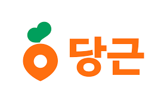

# 2026년 1분기 회고

매년 1년 회고 글을 블로그에 작성했지만, 분기 회고는 처음입니다! 2025년 회고 글을 쓴지 3개월밖에 되지 않았는데 
개인적인 느낌으로는 엄청 오래전 일처럼 느껴집니다. 
이번 분기가 유독 많은 일이 있었어서 그렇게 느껴지는가 싶습니다. 많은 일이 있었던만큼 기록차, 이 글을 읽는 분들께 
알려드릴겸 글을 남깁니다.  
  
***
  
## 퇴사 & 이직 준비
  
[작년 회고 글](https://sooftware.io/2025/)에 적은 것처럼 이번 3월을 끝으로 튜닙을 퇴사하게 됐습니다. 
3개월간 인수인계 기간을 가지며 주 2일 근무를 하기로 회사와 합의했습니다. 그래서 이번 분기는 비교적 
여유로운 시간을 보낼 수도 있었지만, 퇴사를 한다는건 다음 이직할 회사를 찾아야 한다는 것이기 때문에.. 😅 바쁘게 지내게 됐습니다.  
  
### 1. 앞으로 어떤 일을 해야할까?  
  
Speech 엔지니어로 커리어를 시작해서, 튜닙에서 NLP 엔지니어, 그리고 백엔드 개발자로서의 역할까지 수행했습니다. 
언제나 그랬지만, 요즘은 더욱 세상이 빠르게 변한다고 느낍니다. AI Agent의 발전으로 코딩을 모르는 사람들도 
앱을 뚝-딱! 만들 수 있게 됐고, 모르는 개념 공부를 할때도 책을 뒤적거리고 강의를 보는게 아닌 AI와 채팅을 통해서 
1:1 과외를 받을 수 있는 세상이 됐습니다.   
  
창업할 당시인 2021년 초에 GPT-3의 성능을 보며 이런 세상이 조만간 올거다라고 생각은 했습니다만, 막상 
이런 세상이 현실로 다가오니 여러 고민거리가 생겼습니다. 이런 세상에서 내가 무슨 일을 해야할까? 앞으로 10년, 더 짧게는 
5년동안 어떤 일을 하고 어떤 공부를 해야 나라는 사람이 더욱 발전하고 가치를 창출할 수 있을까? 앞으로 일할 수 있는 
날이 얼마나 남았을까? 등의 고민들을 해보게 됐습니다.  
    
위의 고민들은 저만이 아닌 많은 엔지니어분들, 더 나아가서 일을 하는 모든 분들이 하는 고민일겁니다. 
실리콘 밸리에는 클로드 블루(Claude Blue)라는 우울증이 생기고 있다고 합니다. 
산업의 최전선에 있는 실리콘 밸리에 이런 현상이 있다면 이런 현상은 아마도 점점 확산돼서 어느새 우리에게 다가올 것입니다. 
LinkedIn만 봐도 많은 분들이 이런 현상을 걱정하고 앞으로 어떻게 해야할지에 대해서 고민과 걱정들을 하고 있습니다.
****
  
### 2. 고민은 함께 나누면 절반이 된다!
  
고민은 함께 나누면  절반이 된다고 합니다. 나름 저만의 결론을 냈습니다만, 혼자 이런저런 고민과 결정을 하기보다는 저랑 비슷한 고민을 가지고 있을 사람들과 
얘기를 나누며 제 생각도 공유하고, 다른 분들의 생각도 들으면 앞으로의 제 결정에 도움이 될 거라고 생각했습니다. 
그래서 가장 먼저 LinkedIn에 제 상황을 공유했습니다. 지난 5년간의 튜닙 생활을 마무리하고 넥스트 스텝을 고민하고 있으며, 
커피챗을 환영한다는 글을 남겼습니다. 전 튜닙 동료들의 고생했다는 격려와 응원, 그리고 여러 커피챗 요청이 있었습니다. 몇몇 전 동료들과 
만나서 술 한 잔 하면서 이런저런 있었던 일들과 추억 회상과 고민도 나누고 각자가 생각하는 앞으로의 방향에 대해서 진지한 
얘기도 나눴습니다. LinkedIn으로 연락온 분들과 커피챗으로 이런저런 제안 혹은 생각 공유도 하며 꽤나 바쁘게 시간을 보냈습니다. 업계에 있는 여러 분들과 얘기를 나누다보니 점점 생각이 정리가 되며 명확해졌습니다.
  
***
  
### 3. AI Agent Master
  
저의 넥스트 스텝은 **AI Agent Master**로 정했습니다! 카카오브레인, 튜닙을 거치며 AI 모델을 학습해서 
AI 모델을 만드는 일을 주로 했습니다. 
하지만 이제는 모델러라는 정체성을 버릴때가 됐다고 생각합니다. 
지금의 제가 가장 잘할 수 있는 일은 AI 모델을 잘 학습시켜서 좋은 모델을 만드는게 아니라 
학습된 모델의 성능을 뽑아내는거에 더 강점이 있습니다. 
지금도 OpenAI, Anthropic, Google 등 빅테크 기업들이 조금이라도 더 나은 AI를 만들기 위해 경쟁하고 있고, 
국내에서도 '독파모(독자 파운데이션 모델)' 프로젝트로 AI 모델을 만드는 일에 매진하는 분들이 있습니다. 
저는 이런 분들이 잘 만들어 준 AI 모델의 성능을 끌어서 서비스에 적용하는 Master가 되고자 합니다. 
  
제가 생각하는 AI Agent Master가 되기 위해서는 AI가 어떻게 동작하는지에 대해서 이해하고 있어야 하며, 
최신 AI 논문을 읽고 적용하고 방법론을 디벨롭하는 능력이 있어야 하며, 모델링적인 엔지니어링이 필요할 수도 있고,
서비스에 적용하기 위한 백엔드쪽 기술이 필요할 수도 있습니다. 저는 이런 일들에 대한 경험과 강점이 있습니다. 
그래서 저의 넥스트 스텝을 **AI Agent Master**로 정했습니다!
  
***
  
### 4. 지원할 회사 고르기
  
지원할 회사들을 골라서 지원하고 돌이켜서 정리하다보니 아래 세 가지의 기준으로 지원할 회사를 골랐던 것 같습니다.
  
1. 많은 사용자 수를 보유한 서비스를 운영하는 기업
2. AI 기술 적용에 열려있을 것
3. 앞으로 전망이 좋은 회사
  
이렇게 위 3가지 기준으로 총 5군데의 회사에 서류를 넣었습니다!
  
***
  
## 이직
  
요즘은 이직하려면 서류 통과 외에도 면접을 2-3번씩 보더군요. 😅 지원자 입장에서는 피곤했지만, 스타트업에 있으며 인재채용이 얼마나 중요한지 뼈저리게 느꼈기 때문에 
이해가 됐습니다.  
  
사실 회사에 지원이란걸 처음 해봤습니다. 첫 직장인 카카오브레인은 대학생일때 공개했던 오픈소스를 보고 
연락을 받아서 인턴을 거쳐서 정규직 전환이 됐고, 이후 튜닙을 공동창업을 했기 때문에 이력서를 만들어서 회사에 지원해보는 
행동 자체가 처음이였습니다.  
  
한 가지 자랑을 하자면 서류를 넣은 모든 기업에서 서류 합격했고, 최종 합격률도 괜찮았습니다. 😎  
  
저에 대한 자신감이 있었기 때문에 이직하는것에 대해서 걱정을 하진 않았지만, 5월에 결혼을 앞두고 있었기 때문에 
이직 준비 기간이 길어지면 백수인 상태로 결혼을 해야해서 조금 걱정이 되긴 했습니다. 다행히도 몇 회사에서 
저에게 일할 기회를 받아서 감사할 따름입니다.  
  

  
제 다음 직장은 **당근**으로 결정됐습니다!  
  
3번의 면접과 소통 방식, 회사를 방문했을 때의 느낌 등 지원한 회사들 중 가장 가고 싶다는 느낌이 들었습니다. 
다행히도 가장 가고 싶었던 회사에 합격을 하게 됐습니다. 당근에는 4월부터 출근할 예정입니다. 
어느새 저의 세 번째 회사입니다. 당근으로 출근하는게 여러모로 기대되는 요즘입니다. 당근에서 좋은 성과들을 내보겠습니다!

***
  
## 신혼집
  
올해 5월 결혼을 앞두고 있습니다. 😁  
  
결혼 준비에서 가장 큰 지분이 아무래도 신혼집입니다. 작년 말부터 올해 초까지 신혼집을 
구하기 위해서 많은 시간을 썼는데, 잘 마무리하고 이번 3월에 신혼집으로 이사를 왔습니다! 
이삿짐 옮기고, 짐정리하고, 가전가구 받아서 세팅하고.. 등 아직까지 현재진행형으로 신혼집을 하나씩 
꾸려가고 있습니다. 처음엔 실감이 잘 안 났는데, 깔끔하게 집을 정리하고 예비 신부와 같이 지내다보니 
신혼집이라는게 실감이 납니다. 저희만의 보금자리가 생겼다는 생각에 너무 기쁜 요즘입니다! 
 
***
  
## 라식
  
미루고 미뤘던 라식 수술을 이번에 했습니다! 주위에서 라식을 하면 신세계라고들 해서 
진즉에 하고 싶었지만, 하루종일 컴퓨터를 보고있는게 직업인 사람으로써 타이밍을 잡기가 쉽지 않았습니다. 이번 3월에 
회사도 퇴사했겠다, 다음 직장도 정해졌겠다 이때 아니면 또 몇년 뒤에나 기회가 생길 것 같아서 라식 수술을 해버렸습니다.   
  
수술하고나니 왜 주위에서 신세계라고 하는지 이해가 되더군요! 안경이나 렌즈를 끼지 않아도 이렇게 잘 보이다니.. 렌즈는 끼면 
아무래도 이물감이 좀 들고, 안경은 한 번씩 닦아줘야하고 라면 같은거 먹을때 김이 끼는 등 불편한 점들이 많았는데 라식을 하고나니 너무 편합니다. 
라식 고민하시는 분들.. 정말 강력하게 추천합니다. 👍
  
***
  
위에 쓴것처럼 2026-1분기에는 여러 일들이 있었습니다. 1분기는 남은 2026년을 위한 
사전 준비였다고 생각합니다. 2분기부터는 새 신부, 새 직장, 새 집, 새 눈을 가지고 힘차게 살아보겠습니다!!  
  