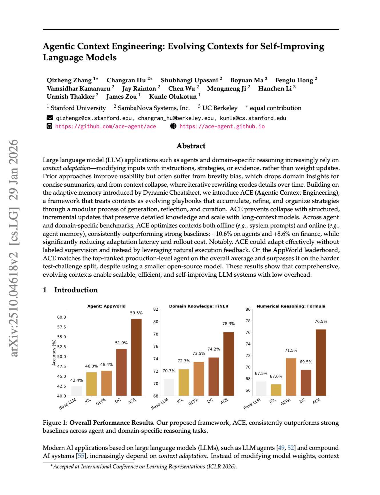
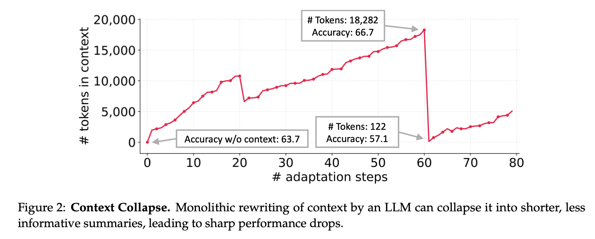
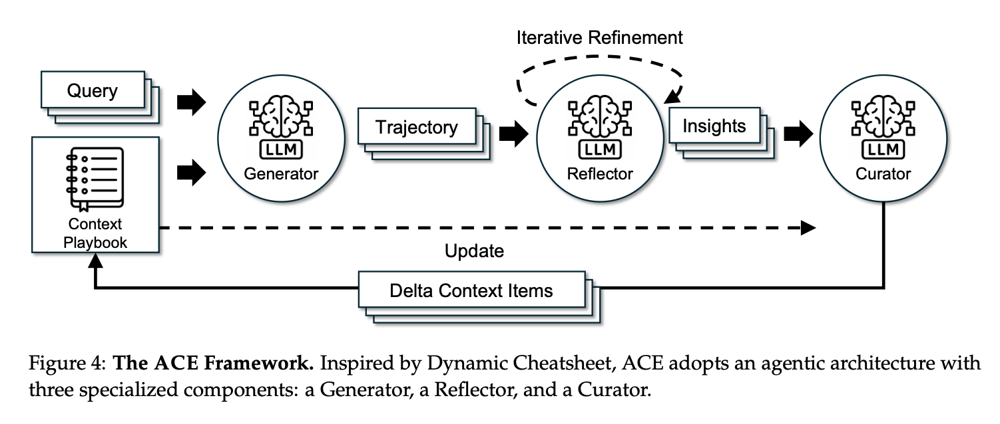
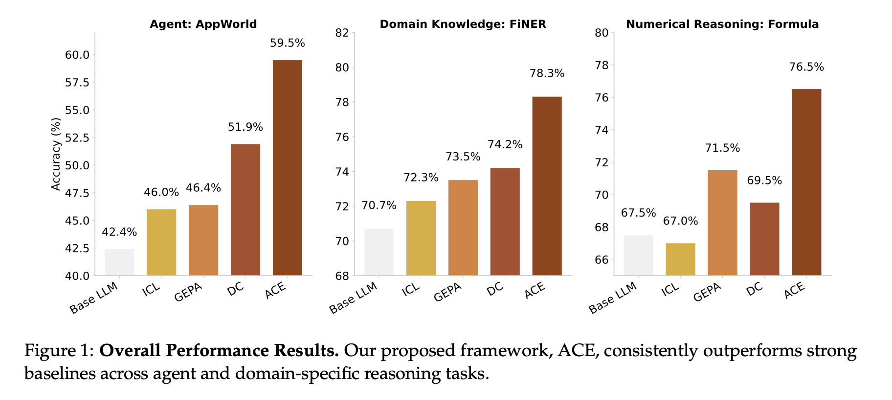
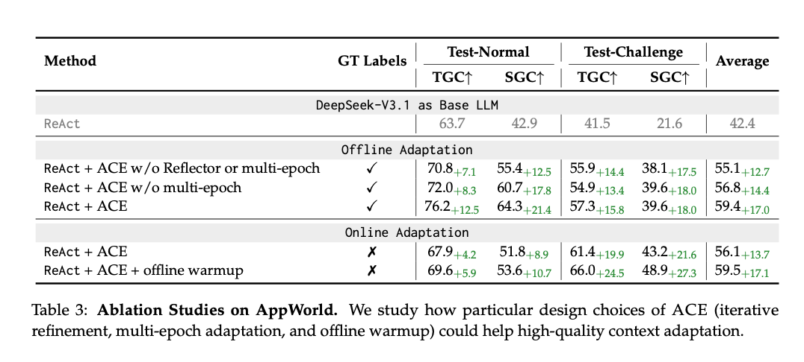

# Agentic Context Engineering: Evolving Contexts for Self-Improving Language Models Paper Review
    
흥미로운 최신 AI Agent 논문을 읽어서 기록차 페이퍼 리뷰를 남깁니다.  



| https://arxiv.org/abs/2510.04618

## Context Adaptation

| 요즘 누가 Fine-tuning해? 🤷‍♂️

기존에는 domain-specific한 AI Agent를 만들기 위해서는 AI 모델의 weight를 직접 업데이트 시켜주는 fine-tuning이 기본이였습니다. 하지만 최근에는 점점 ***Context Adaptation***이라는 방법을 주로 사용합니다. LLM(Large Language Model)에 들어가는 인풋을 조정함으로써 domain-specific한 Agent를 만드는게 대세입니다.   

이전에는 gradient 기반으로 weight를 업데이트 하면서 성능 최적화를 했다면, 이제는 고정된 weight에 프롬프트를 조정하면서 최적화를 하는 식으로 패러다임이 전환됐습니다.

### Brevity bias & Context collapse

저자들은 이러한 **context adaptation** 과정에서 **brevity bias**와 그로 인해 발생하는 **Context Collapse** 문제를 꼬집습니다.   

- **Brevity bias** : AI Agent들의 간결함을 추구하는 경향
- **Context collapse** : Brevity bias로 인해 반복적으로 context를 re-write하다가 디테일한 부분이 사라짐

즉, 요즘의 AI Agent들이 context를 최신화하며 업데이트하는 과정에서 간결성을 추구하는 경향이 있다보니, re-write하는 과정에서 디테일한 context가 사리지고 이게 Agent들의 성능 하락에 영향을 미친다는 것입니다.  




실제로 저자들이 context adaptation을 수행했을 때, 위 그래프에서 볼 수 있듯이, step이 누적됨에 따라서 어느 순간 context를 압축하는 경향이 관찰됐습니다. 18,282 token => 122 token이라는 말도안되는 압축률로요. 그 결과, 오히려 context가 없는 baseline보다도 낮은 Accuracy를 기록하게 됩니다.

  
## ACE (Agentic Context Engineering)



그래서 저자들은 이러한 **Context Collapse** 문제를 해결하기 위해 ACE를 제안합니다. ACE는 핵심 아이디어는 ** "Contexts as evolving playbooks" **입니다. Context를 매번 re-write하면서 정보를 잃어버릴게 아니라, 계속 축적하고 구조화함으로써 성능을 개선한다는게 핵심입니다.  

이제 ACE의 구조에 대해서 살펴보겠습니다. 🧐  

### ACE의 세 모듈과 Playbook  

ACE를 구성하는 세 가지 모듈을 살펴보겠습니다:
  
#### 1. Generator
  
Generator는 들어온 Query에 대한 문제를 해결하는 모듈입니다. 이때 모델이 어떤 정보를 가지고 어떤 생각을 해서 그런 결론이 나왔는지를 모두 기록합니다. 이것을 **Reasoning Trajectory**라고 합니다. 이 정보를 통해 Generator가 어떤 분석을 했고, 어떤 실수를 하는지를 파악할 수 있습니다.

#### 2. Reflector   

Reflector는 Generator가 생성한 **Reasoning Trajectory**를 분석하고 insight를 생성합니다. Generator가 뭘 잘했고, 뭘 못했는지에 대한 insight를 반복해서 학습하며 점점 더 정확한 피드백을 제공합니다. (정확히는 기대)
  
#### 3. Curator
  
Curator는 Reflector가 보낸 insight를 구조화된 형태로 컨텍스트에 기록합니다. 이때 전체 컨텍스트를 다시 쓰는게 아닌, 이번 추론에서 얻은 insight에 대한 부분만 추가/업데이트합니다. 즉, 필요한 부분만 수정하거나 bullet 형태로 새로운 지식을 추가하기만 합니다. 이때 bullet 형태로 기록되는 곳을 **Context Playbook**이라고 부릅니다.  

***  

구체적인 예시를 한 번 들어보겠습니다!  

AI Agent가 사용자가 들을 다음 노래를 자동으로 설정하는 태스크를 가정해보겠습니다.  

#### 0. Input

- Task : 사용자의 청취 기록을 바탕으로 다음 곡 추천
- Song History:
	- "Bohemian Rhapsody" (100% 청취)
	- "Stairway to Heaven" (95% 청취)
	- "Despacito" (5% 청취)
- Playbook: 
	- [str-00001]helpful=5 harmful=0 :: 가장 최근 들었던 노래와 같은 장르 추천

#### 1. Generator


  
```
Reasoning:
1. 사용자가 최근에 들은 곡 확인...
2. Playbook을 보니 최근에 들었던 노래와 같은 장르 노래를 추천해주는게 좋을 것 같음
3. Despacito와 같은 장르 곡 추천
```

   
**Output:**
- 추천곡 : "Bailando"
- 피드백 : 10% 청취 후 스킵 (harmful)

#### 2. Reflector
  
**Input:**
- Generator의 reasoning 과정
- 추천곡 : "Bailando"
- 피드백 : 10% 청취 후 스킵 (harmful)
  
**Process:**
  
```json
{
  "reasoning": "Generator가 '최근 곡'인 Despacito를 기준으로 판단했는데,
                실제로 사용자는 그 곡을 5% 청취 후 스킵했음.
                이건 사용자가 싫어하는 신호인데 오히려 비슷한 곡을 추천했음.
                반면 Bohemian Rhapsody와 Stairway to Heaven은 거의 끝까지 들었는데
                이 곡들은 클래식 록 장르임.",
  "error_identification": "낮은 청취율(5%)의 곡을 선호 신호로 잘못 해석",
  "root_cause_analysis": "단순히 '최신'만 보고 판단했고, 
                          청취 완료율이라는 중요한 피드백 신호를 무시함",
  "correct_approach": "1) 청취율 80% 이상인 곡들만 선호 곡으로 판단
                       2) 20% 미만인 곡들은 비선호로 판단
                       3) 선호 곡들의 공통 장르/아티스트 패턴 찾기
                       4) 그 패턴에 맞는 새로운 곡 추천",
  "key_insight": "청취 완료율이 추천의 핵심 신호다.
                  - 80%+ = 강한 선호
                  - 20%- = 강한 비선호
                  최근성보다 청취 완료율을 우선해야 함"
}
```
  
  
**Output:**

- Key lesson : "청취 완료율이 추천의 핵심 신호다. ~ 최근성보다 청취 완료율을 우선해야 함"
  
  
#### 3. Curator

**Input:**
- Playbook: 
	- [str-00001]helpful=5 harmful=0 :: 가장 최근 들었던 노래와 같은 장르 추천
- Reflector insight : "청취 완료율이 추천의 핵심 신호다. ~ 최근성보다 청취 완료율을 우선해야 함"
   
**Process:**

  
```json
{ 
	"reasoning": "Reflector가 중요한 패턴을 발견했다. 
				  청취 완료율이 추천 정확도의 핵심 신호라는 것. 
				  이건 Playbook에 없는 완전히 새로운 전략이므로 추가해야 함.
				  Playbook [str-00001]에 대한 harmful 점수 업데이트 필요", 
	"operations": [ 
		{ 
			"type": "ADD", 
			"section": "music_recommendation_strategies", 
			"content": "청취 완료율로 선호도 판단 
						- 80% 이상 청취: 강한 선호 신호 
						- 20% 미만 청취: 강한 비선호 신호 
						- 최근성보다 청취율을 우선순위로 
						- 선호 곡들의 공통 장르/아티스트 기반 추천" 
		},
		{ 
			"type": "UPDATE_COUNTER",  // ← 이 부분 수정
			"bullet_id": "str-00001", 
			"counter": "harmful",
			"increment": 1 
		}
	] 
}
```

  
**Output:**
```
[str-00001] helpful=5 harmful=1 :: 
	- 가장 최근 들었던 노래와 같은 장르 추천
[str-00002] helpful=5 harmful=0 ::
	- 청취 완료율 기반 필터링 
	- 80%+ 청취 = 선호 곡으로 분류 
	- 20%- 청취 = 비선호 곡으로 분류 
	- 최근성 < 청취 완료율 (우선순위) 
```

***

간단한 "플레이리스트 다음 곡 추천"이라는 주제를 예시로 ACE의 동작을 살펴봤습니다! 이해하시는데 도움이 됐으면 좋겠습니다.  
  
## ACE의 핵심 포인트

### Incremental Delta Updates

저자들이 계속 강조하는 포인트입니다. ACE는 전체 컨텍스트를 매번 재작성하는게 아니라, 필요한 부분만 국소적으로 수정 및 추가함으로써 **Context Collapse**를 방지합니다. 또한, 매번 Context를 다시 쓰는게 아니므로, 불필요한 토큰 사용량을 줄임으로써 계산 비용을 절감합니다.  

### Grow-and-Refine

예시를 든 위 상황이 온라인에서 계속 반복된다면, Playbook에는 지속적으로 context가 쌓일 수 밖에 없습니다. 이때 semantic embedding 등으로 비슷한 bullet은 삭제하거나 통합하고, harmful이 높은 경우 삭제하는 등 rull-base로 playbook의 총량을 컨트롤합니다.


## 그래서 얼마나 좋은데?  

. 

ACE는 기존 context adaptation 기법들 대비해서 우수한 성능을 보였습니다.  

- AppWorld LLM Agent Benchmark : 기존 베이스라인 대비 평균 10.6%의 정확도 향상
- FiNER (금융 분석 벤치마크) : 적응 지연 시간을 평균 86.9%로 단축, 토큰 사용량, 롤아웃 횟수 크게 감소

즉, 기존 방법들 대비 많이 좋아졌다고 합니다.

### Ablation Study



좋아졌다면, 왜 좋아졌는지를 파악하는게 중요합니다. 그렇기 때문에 Ablation Study를 꼭 확인해야되는데, 저자들이 이를 잘 실험해줬습니다!  

#### Reflector & Multi-Epoch

위 Table 3에서 볼 수 있듯이 reflector와 multi-epoch이 없을시에 성능이 하락했습니다. 즉 Reflector의 insight가 성능 향상에 기여했다는 것이며, 한 번만 학습하기보다는 여러 epoch에 걸쳐 반복 학습해주며 Playbook을 점진적으로 정제하는것이 성능 향상에 도움이 됐다고 합니다.

#### Offline Warmup

Playbook이 빈 리스트인채로 온라인에서 적용하기보다는, 훈련 데이터로 먼저 Playbook을 어느정도 구축한 후에 온라인에서 적용하는 것이 효과적이였다고 합니다. 

***  

## 이 논문이 제시하는 방향

결국 이 논문에서 가장 중요한 것은 ACE가 제안하는 방향인 것 같습니다. 모델을 학습하며 domain adaptation을 하는 방향이 아닌, Context를 조절하면서 Self-Improving Agent가 되어야하며, 이때 컨텍스트 전체를 re-write하는 위험성 높은 방향이 아니라 시간과 경험을 통해 하나씩 축적하고 수정해나가는 방향이어야한다는 것입니다.  

사람도 기존 지식에 하나씩 새롭게 추가해가면서, 기존 지식의 잘못된 부분을 업데이트 해나갑니다. 사람들이 각자가 가진 경험(Context) 전체를 re-write 한다면 너무나 risky한 것처럼, AI Agent 역시 조금씩 수정해나가며 성능을 개선해나가야 한다는 것입니다.  

지금 ACE가 제시한 방법이 최선의 방법은 아니겠지만, 전체적인 방향성에 많은 공감이 됐습니다.   

이 방향성에서 어떤 부분을 어떻게 개선할 수 있을지에 대해서 앞으로 고민을 해봐야겠습니다.
