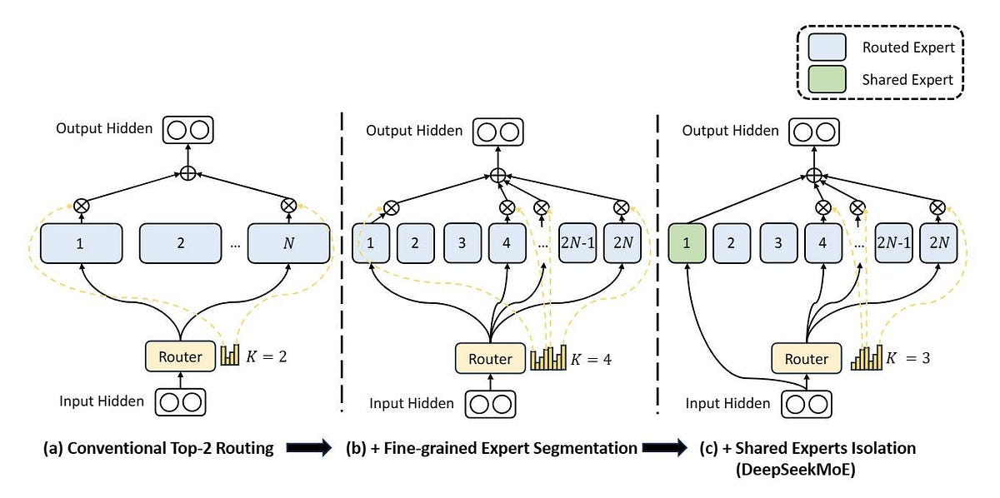
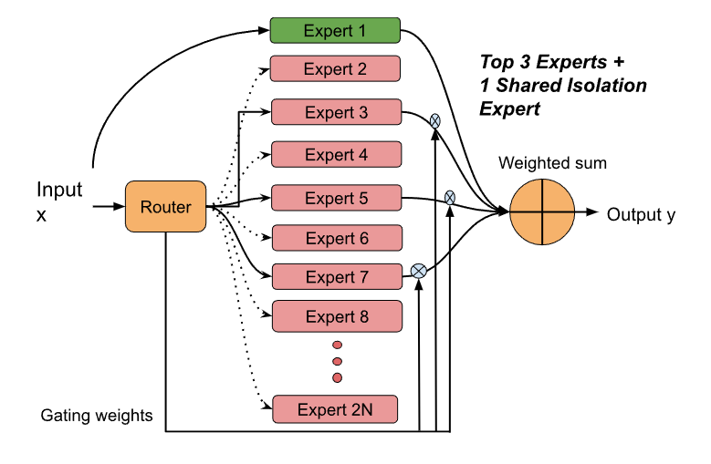
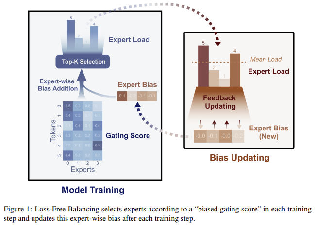
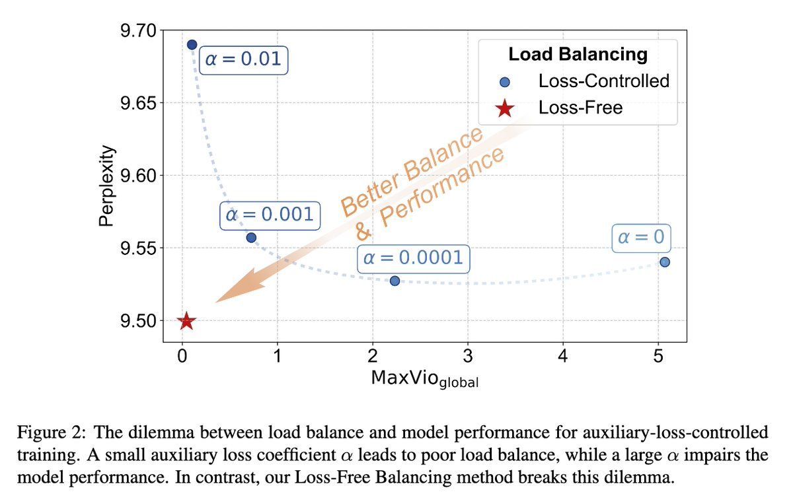

# MoE(Mixture of Experts) 기초부터 DeepSeek 혁신까지
  
작년 이맘때쯤 DeepSeek-V3가 저비용으로 엄청난 성능을 보이면서 화제가 되었습니다. 그 핵심 기술인 MoE(Mixture of Experts)에 대해서 어떻게 발전시켰는지 살펴보겠습니다.

## 1. MoE란?

### 핵심 아이디어

**기존 트랜스포머 구조처럼 모든 파라미터를 항상 사용하지말고, 입력에 따라 선택적으로 활성화해서 쓰자!**

**부분적 활성화**는 MoE의 핵심입니다. 기존 Dense Model처럼 모든 토큰 생성마다 모든 파라미터를 전부 사용하는게 아니라, 각 토큰별로 전문가(Expert)를 두고 선택적으로 활성화하자는 겁니다.

## 2. 기본 MoE 구조

### Transformer에서 MoE 적용


전통적인 Transformer의 FFN(Feed-Forward Network) 레이어를 MoE로 교체합니다.

#### Mixtral 8x7B 예시
- 8개의 experts (각 7B 파라미터)
- 토큰당 2개만 선택 (Top-2 routing)
- 총 47B 파라미터 중 활성 13B
- FFN layer만 MoE로 교체, attention은 shared

## 3. DeepSeek의 혁신 ①: Fine-Grained Expert Segmentation

#### 문제 인식

기존 MoE(ex. Mixtral)의 한계:

```
8개의 expert 중 2개 선택
→ 조합의 경우의 수: 28가지
→ 제한적인 유연성
```

#### 해결책 : Expert를 더 여러개로 나누기



Expert 수를 늘리고, 선택의 경우의 수도 늘리되, 계산량은 유지:  
  
```
[기존 Mixtral] 
8개 expert, 2개 선택 
각 expert = 7B 파라미터
 → 14B 활성화 
 
 [DeepSeek Fine-Grained] 
 32개 expert, 8개 선택 (4배씩 증가) 
 각 expert = 1.75B 파라미터 
 → 14B 활성화 (동일!) 
 → 조합의 경우의 수: 🆙
```

#### Multi-Head Attention과의 유사성

이 개념은 개인적으로 **Single-head Attention → Multi-head Attention**과 유사하게 느껴집니다.  

| 구분  | Single → Multi   | Coarse → Fine-Grained |
| --- | ---------------- | --------------------- |
| 나누기 | 1개 → 8개 head     | 8개 → 256개 expert      |
| 활성화 | 모두 사용            | 일부만 선택                |
| 효과  | 다양한 attention 패턴 | 다양한 expert 조합         |
  
이처럼 기존의 덩어리를 더 작지만 여러개로 나누면서 **성능 향상**이라는 효과를 얻었습니다.  

## 4. DeepSeek의 혁신 ②: Shared Expert Isolation  

#### 문제 인식  

Fine-grained로 expert를 잘게 쪼갰더니 새로운 문제 발생:  
- 여러 expert가 같은 기본 지식을 중복해서 학습
- 파라미터 낭비..
  
#### 원인 :

- 각 expert가 독립적으로 학습하다보니 다들 공통 지식을 각자 배움
- 공통 지식을 배우다보니 특화된 지식을 배울 공간(파라미터)이 부족해진다는 단점
  
#### 해결책 : 공통 지식을 따로 빼자!



**Shared Expert**

- 항상 활성화하는 Expert를 따로 둠으로써, 이 expert가 공통 지식을 담당→ 파라미터 효율 증가
- 나머지 Expert들의 특화도 증가 : 나머지 Expert들은 공통 지식을 제외한 특화 지식에만 집중되도록 학습


## 5. Expert는 어떻게 특화되는거지?

여기서 놀라운 사실인데, 따로 특화시키지 않습니다.  

```
연구자가 하는 것:
❌ "너는 수학 expert야!"
❌ "너는 코드 expert야!"
❌ Expert별로 다른 데이터 주기

실제로 하는 것:
✅ 그냥 전체 데이터로 같이 학습
✅ Router와 Experts를 end-to-end로 학습
✅ 알아서 특화됨!
```

랜덤하게 초기화 된 Expert들은 학습이 되면서 자연스럽게 수학에 강한 Expert, 코딩에 강한 Expert와 같이 나뉘어지게 됩니다.  

**실제 Mixtral 8x7B 분석 결과:**

```
Expert 0: 코드 관련 토큰에 강하게 반응 
Expert 2: 수학 수식에 강함 
Expert 5: 프랑스어에 특화 
Expert 7: 범용적 (다양한 토큰)
```
  
## 6. Load Balancing



#### 문제 인식

Expert가 자연스럽게 특화되는 건 좋지만, 문제가 생깁니다.   

256개의 Expert 중 N개의 Expert만 운 좋게 초반에 잘 맞추게 된다면, 해당하는 N개의 Expert들만 집중적으로 학습되게 됩니다.  

**문제점:**

- 나머지 256 - N개의 expert 파라미터 낭비
- N개의 expert에 과부하
- 다양성 X
- 256개로 나눈 의미가 없어짐

### Auxiliary Loss 도입

이러한 문제점을 해결하기 위해 Auxiliary Loss를 도입했습니다. Auxiliary Loss는 N개의 숫자가 있을 때 다양하게 선택이 되도록 학습되는 Loss입니다.  

- Total Loss
```
total_loss = main_loss + λ * aux_loss = "정답 맞추기" + "골고루 쓰기"
```

그래서 MoE 구조에서 처음에는 이렇게 Auxiliary Loss를 도입해서 load balancing 문제를 해결했습니다.  

### Auxiliary Loss의 문제점

위 Total Loss 수식에서 보듯이, 전체 로스에서 Auxiliary Loss가 더해지게 됩니다. 여기서 문제가 생기는데,
  
**딜레마:**

- λ 크게 설정: 골고루 쓰지만 성능 나쁨
- λ 작게 설정: 성능 좋지만 불균형 심각  

위와 같은 딜레마가 생기게 됩니다.  

## 7. DeepSeek의 혁신 ③: Auxiliary-Loss-Free  

#### 핵심 아이디어  

꼭 Auxiliary Loss로 해야해? 라우팅만 골고루 하게 하면 되는거 아니야?  

***

기존 방식에서는 router가 expert들을 골고루 선택하게 하기 위해 Auxiliary Loss를 도입했는데, DeepSeek에서는 이거를 bias control로 loss 없이 구현해냈습니다!  

매 N-step마다 expert들의 사용량을 체크하고, 상대적으로 많이 사용되는 expert의 bias는 -하고, 적게 사용되는 expert의 bias는 +하는 방식으로 컨트롤합니다.  
  

  
이 단순한 방식으로 DeepSeek은 load balancing 문제를 풀었습니다.   

Auxiliary Loss 도입으로 인해 전체 학습에 방해가 되니, 이를 간단한 bias control로 gradient에 영향이 없도록 하여 성능을 개선했습니다!  

실제로 이러한 bias 방식을 도입했더니, auxiliary loss를 사용했을때랑 대비해서 expert들간의 불균형도가 조금 높아지긴 했지만, 모델 성능 자체는 더 좋아졌다고 합니다.

이상으로 DeepSeek에서 MoE 구조를 어떻게 개선했는지 살펴봤습니다.
