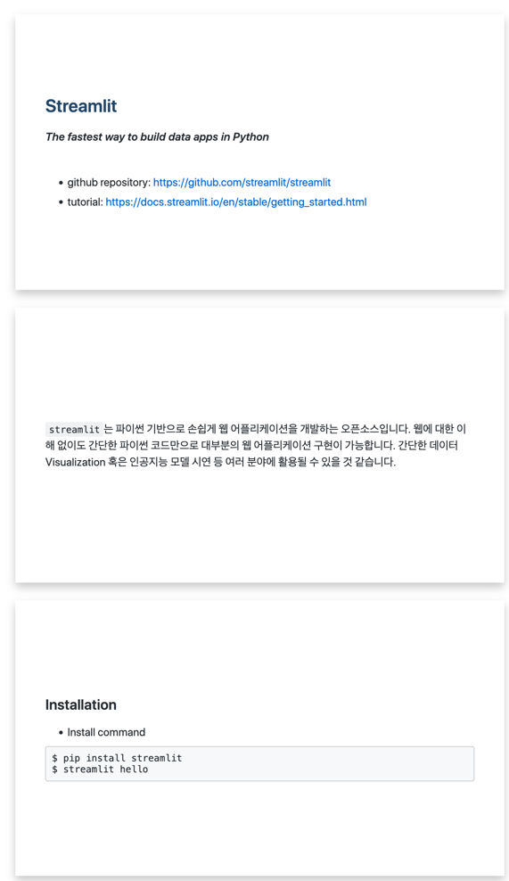
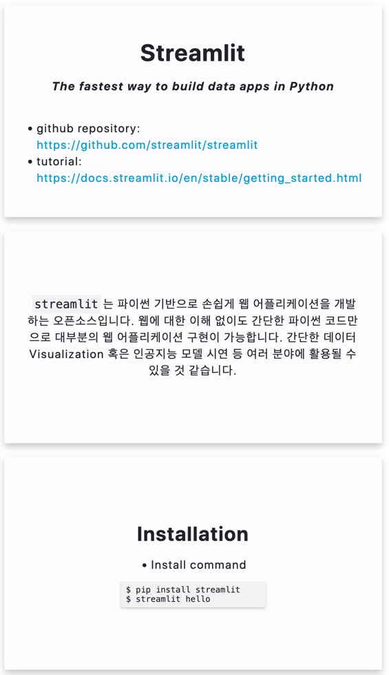

# 마크다운으로 발표자료 만들기 (Marp for VS Code)
 
저는 개인적으로 무언가를 정리할 때 텍스트 레벨에서 모든 편집이 가능한 마크다운(Markdown)을 선호합니다. 
그래서 제 블로그 포스팅도 모두 마크다운으로 작성되어 있는데요, 가끔 제가 정리해둔 문서로 발표자료 형식으로 
만들어야 할 때가 종종 있습니다. 사내 세미나라던지, 스터디라던지 등등..
  
예전에는 PPT나 Keynote를 써서 하나하나 발표자료로 재구성하곤 했는데, 
'이 마크다운 형식을 쉽게 발표자료로 바꿀수는 없을까?'라는 생각에 조금 찾아보니 
역시나 개발된 프로그램이 있었습니다.  
  
## Marp (Markdown Presentation)
  

  
MARP는 위에 설명한대로 마크다운 형식의 파일을 쉽게 발표자료로 사용하게 해주는 프로그램입니다. 
여러 IDE의 확장 프로그램으로 사용이 가능한데, 저는 VS Code를 이용해서 사용했습니다.
  
### Marp Extension 설치
  

  
Vscode의 Extension 창에서 marp를 검색하면 쉽게 설치 가능합니다.
  
### Usage
  
사용 예시로 아래와 같은 마크다운 파일이 있을때 적용해보겠습니다.  
  
```markdown
# Streamlit

***The fastest way to build data apps in Python***
  


- github repository: https://github.com/streamlit/streamlit
- tutorial: https://docs.streamlit.io/en/stable/getting_started.html

`streamlit`는 파이썬 기반으로 손쉽게 웹 어플리케이션을 개발하는 오픈소스입니다. 웹에 대한 이해 없이도 간단한 파이썬 코드만으로 대부분의 웹 어플리케이션 구현이 가능합니다. 간단한 데이터 Visualization 혹은 인공지능 모델 시연 등 여러 분야에 활용될 수 있을 것 같습니다.

## Installation

- Install command
$ pip install streamlit
$ streamlit hello
```

위와 같은 마크다운 파일을 아래처럼 바꿔주면 됩니다.
  
```markdown
---
marp: true
---

# Streamlit

***The fastest way to build data apps in Python***
  


- github repository: https://github.com/streamlit/streamlit
- tutorial: https://docs.streamlit.io/en/stable/getting_started.html
  
---

`streamlit`는 파이썬 기반으로 손쉽게 웹 어플리케이션을 개발하는 오픈소스입니다. 웹에 대한 이해 없이도 간단한 파이썬 코드만으로 대부분의 웹 어플리케이션 구현이 가능합니다. 간단한 데이터 Visualization 혹은 인공지능 모델 시연 등 여러 분야에 활용될 수 있을 것 같습니다.

---

## Installation

- Install command
$ pip install streamlit
$ streamlit hello
```
  
맨 위에 아래 텍스트를 넣어주고, 페이지 구분을 `---`로 표시해주면 됩니다. 
  
```
---
marp: true
---
```
  
위와 같이 바꿔주게 되면 다음과 같이 슬라이드를 미리 볼 수 있습니다.
  

  
### Theme
  
위 발표자료가 조금 심심하게 느껴질 수 있습니다. 
편리한 대신, 디테일하게 하나하나 조정하기는 어렵습니다만, 
사전에 등록되어 있는 테마들을 이용해서 밋밋한 발표자료를 조금 개선할 수 있습니다.  
  
```markdown
---
marp: true
theme: uncover
---
```

위와 같이 `theme: 테마명`을 표시해주게 되면 해당 테마가 적용된 발표자료로 변환됩니다.  
  

  
## 발표자료로 변환
  

  
이렇게 작성된 발표자료를 pdf 등의 형식으로 내보내려면 오른쪽 상단 2번째에 위치한 버튼(삼각형 2개)을 누르고 
상단에 뜨는 'Export slide deck' 버튼을 누르면 됩니다.
  