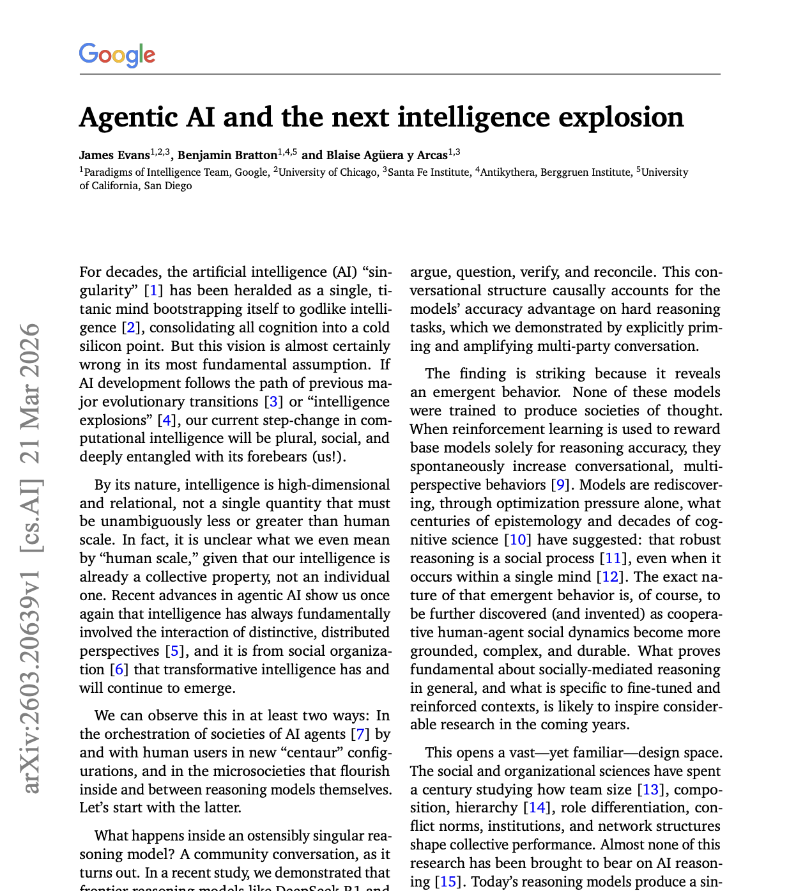

# Agentic AI and the next intelligence explosion

| https://arxiv.org/abs/2603.20639
  
다들 하나의 AI가 초지능을 가지는 특이점을 생각하지만, 이건 틀린 프레임이라는 논문.  
  
딥마인드에서 냈고, 단일 초지능이 아닌 AI Agent들이 서로 다른 관점에서 토론하며 지능의 발전이 
폭발적으로 일어날것이라는 예측이다.   
  
## 핵심 내용
  
1. 추론 모델 내부에서 사회가 자연발생했다  
  
DeepSeek-R1 같은 모델을 분석했더니, 모델이 '오래' 생각해서 성능이 오른게 아니라, 
Chain of Thought 안에서 서로 다른 관점에서의 피드백을 주면서 이게 성능을 올리는 패턴이 되었다. 
한마디로 Chain of Thought 안에서 작은 사회가 생겼다는 것.
  
2. 이건 역사적으로 반복된 패턴이다
  
영장류 → 언어 → 문자 → 관료제. 모든 지능 폭발은 개인이 똑똑해진 게 아니라 집단 조율 구조가 새로 생겼을 때 일어났다. LLM도 결국 인류 집단 인지의 결정체다.
  
3. 다음 경쟁력은 모델이 아니라 구조 설계다
  
파라미터 크기나 학습법이 아니라, 에이전트들이 서로 다른 시점으로 협력·갈등·조율하는 사회적 구조를 얼마나 잘 설계하느냐가 다음 Explosion의 핵심이다.  
  
***
  
정리되지 않은 생각으로만 가지고 있던걸 짧은 페이퍼로 잘 표현해준 논문. 이미 AI의 성능은 충분히 올라왔고, 
이 AI들을 어떻게 잘 쓸 것인가가 Next Explosion의 핵심일 것 같다.